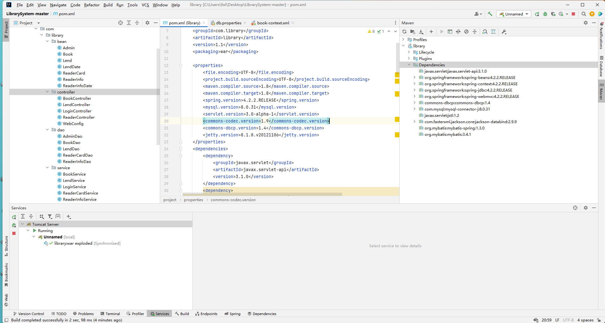
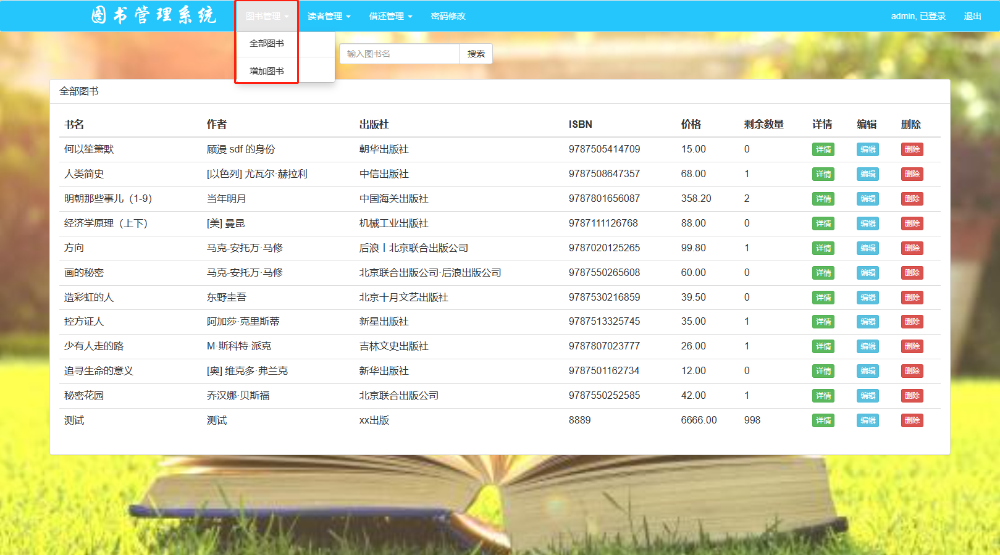
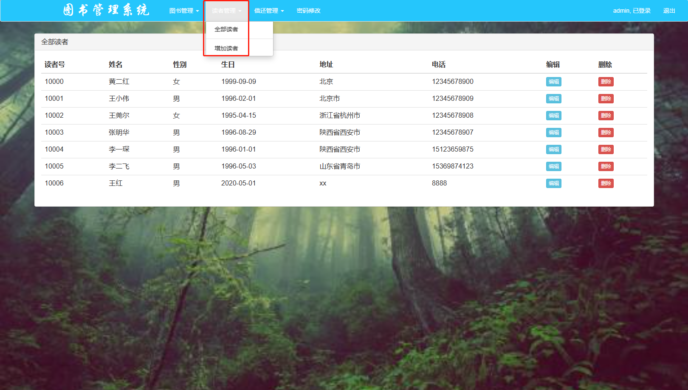
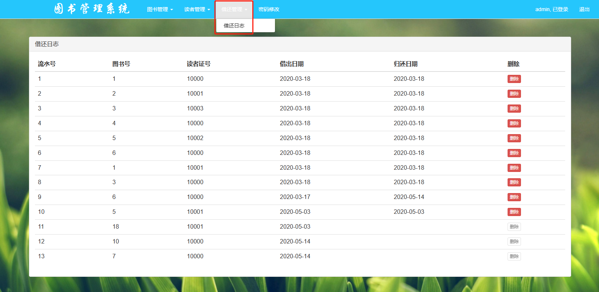
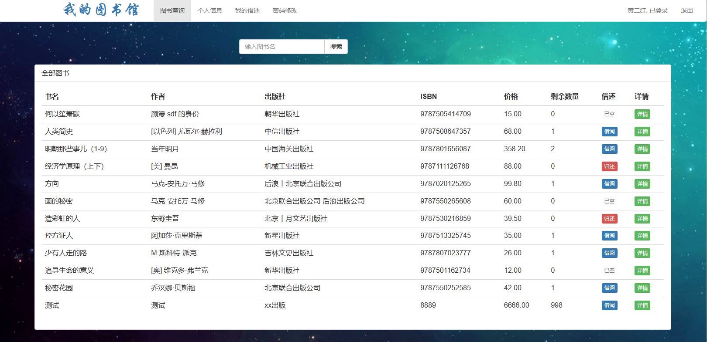
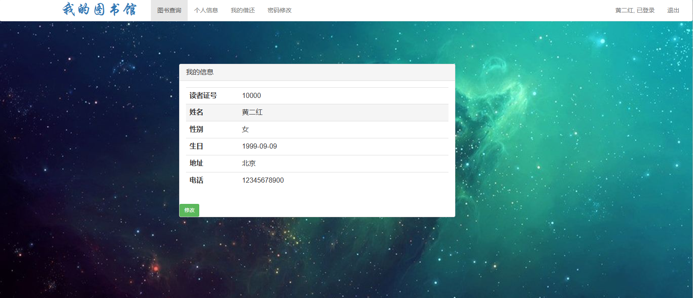
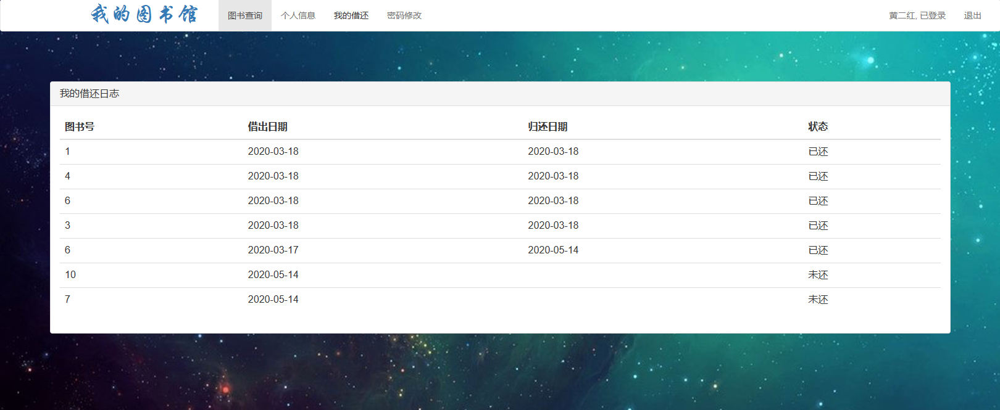

# 图书馆借阅管理系统

### 9.9￥ 获取完整源码+sql，需要加Q：3577148218 ,备用Q: 3808981644
### 有问题，或者需要协助调试运行项目的也可联系
### 更多项目： https://github.com/34426?tab=repositories

## 介绍

基于Spring + Spring MVC + MyBatis的图书馆管理系统。
主要功能包括:图书查询、图书管理、图书编辑、读者管理、图书的借阅与归还以及借还日志记录等。

## 一、管理员功能页面展示

## 二、用户功能页面展示

### 9.9￥ 获取完整源码+sql，需要加Q：3577148218 ,备用Q: 3808981644
### 有问题，或者需要协助调试运行项目的也可联系

